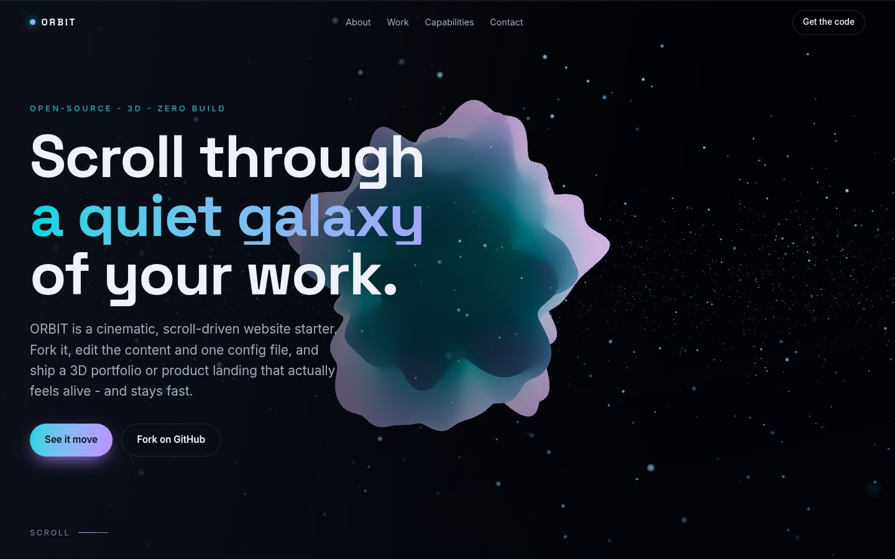

# ORBIT

**A free, open-source 3D scrollytelling website starter.** Semantic HTML first, cinematic three.js
second: fork it, edit the content and one config file, and deploy a scroll-driven portfolio or product
landing where the 3D enhances the page and never gets in its way.

**[Live demo](https://dilip-kumar-22.github.io/orbit/)** · **[Source](https://github.com/Dilip-kumar-22/orbit)** ·
[Changelog](CHANGELOG.md) · MIT licensed · no build step required



## Why ORBIT

- **The content never depends on the 3D.** JavaScript off, three.js blocked, no WebGL, a lost GPU context:
  the text, navigation and links keep working, and each of those failures is a test.
- **Real 3D, behind real text.** A morphing noise-displaced core, a particle galaxy, bloom and a film
  grade, layered under selectable, crawlable HTML.
- **Smooth, never scrolljacked.** Native scroll drives an eased camera through per-section "stages".
- **Adapts to the device.** Quality tiers (`low` / `medium` / `high`) and an `auto` mode that starts from
  the device and lets measured frame time decide. Details and measurements: [docs/PERFORMANCE.md](docs/PERFORMANCE.md).
- **One runtime dependency, self-hosted.** three.js 0.186.1 lives in `vendor/three/` with a hash manifest:
  no CDN, no third-party request, no tracking, no cookies.
- **Locked down.** A strict Content-Security-Policy and modern security headers
  ([docs/HOSTING.md](docs/HOSTING.md) says which hosts get which).

## Quick start

It is a static site; there is nothing to build.

```bash
git clone https://github.com/Dilip-kumar-22/orbit
cd orbit
npm start          # zero-dependency static server (Node 22.22+), http://127.0.0.1:4173
# or any static server:  python -m http.server   /   npx serve .
```

Open it over `http://`: browsers refuse ES modules from `file://`.

## Make it yours

1. **Content**: edit `index.html`. Hero, About, Work cards, Capabilities and Contact are plain HTML. Add a
   Work card by copying one `<li class="card reveal">`. Add `data-i="1"`..`"9"` to a `.reveal` element to
   stagger it.
2. **The 3D look**: edit `src/config.js`. Colours are OKLCH; each `data-scene` section gets a stage
   (`hue`, `cameraZ`, `coreScale`, `particleRotation`) and the scene blends between them as you scroll;
   `quality` holds the tier profiles. Every value has a documented range and falls back to its default with
   a console warning if it is out of range.
3. **Brand colour**: `--accent-a` / `--accent-b` in `styles/main.css`, and `coreA` / `coreB` in `config.js`.
4. **Your URLs**: point `<link rel="canonical">`, `og:url`, `og:image` and `twitter:image` in `index.html`
   at your site (`npm test` checks they agree), edit `assets/og.svg` and run `npm run build:og` for the
   1200x630 social image, then `npm run security:sync` if you changed the import map.
5. **Contact**: the demo's second contact button links to the issue tracker; put your own link there.
6. **Keep the notices**: `THIRD_PARTY_NOTICES.md` must travel with the code (three.js, the noise shader and
   the fonts are third-party and MIT / OFL licensed).

Try settings without editing files: `?quality=low|medium|high|auto`, `?debug` (a diagnostics overlay), or
set `window.ORBIT_CONFIG = { ... }` before `src/app.js` (deep-merged over the config; handy when embedding).

## Accessibility

What is built in, and what is checked automatically (Playwright + axe, on every change):

- Semantic landmarks, a skip link that moves focus into `<main>`, visible focus rings, and
  `aria-current="location"` on the active section link.
- A mobile menu that follows the disclosure-navigation pattern (button state, Escape, focus return), with
  the links simply visible when JavaScript is off.
- `prefers-reduced-motion` is honoured before load **and while the page is open**: reveals and scroll
  smoothing stop and the canvas renders a still frame (or, with `reducedMotionScene: 'disabled'`, is not
  created at all).
- Forced-colors and `prefers-contrast: more` styles; print styles; no horizontal scroll from 320 px to
  400% zoom.
- The canvas is `aria-hidden`; all meaning lives in the HTML.
- Text contrast: every text colour token is at least 4.5:1 (body text 15:1 or more) on the page, the glass
  panels, the cards and the footer, verified in `tests/unit/contrast.test.js`.

What is **not** claimed: full WCAG conformance. Automated checks catch a useful subset of problems, and text
over the live 3D scene (a bloom-lit rim behind a translucent panel is the worst case) is not formally
verified. Manual testing with real assistive technology is still yours to do.

## Browser support

Needs ES modules with import maps, WebGL2, `oklch()` and the `lvh` viewport unit: Chrome and Edge 111+,
Firefox 113+, Safari 16.4+. The content is plain HTML, so older browsers should still show it. **Tested locally in
Chromium only; CI also runs Firefox and WebKit** (specs that need WebGL skip themselves where a CI machine
has none).

## Commands

| Command                     | What it does                                                                         |
| --------------------------- | ------------------------------------------------------------------------------------ |
| `npm start`                 | Serve the source tree with the security headers (no build)                           |
| `npm run dev`               | Vite dev server with hot reload                                                      |
| `npm run build` / `preview` | Optimised `dist/` (tree-shaken three.js, hashed assets) and a server for it          |
| `npm run verify`            | Lint, format, HTML validation, repo checks, vendor + header drift checks, unit tests |
| `npm run test:e2e`          | Browser suite (`ORBIT_BROWSERS=chromium,firefox,webkit`, `ORBIT_TARGET=dist`)        |
| `npm run vendor`            | Re-vendor three.js after bumping it ([CONTRIBUTING.md](CONTRIBUTING.md))             |
| `npm run bench` / `weight`  | Frame-rate per tier / page weight                                                    |

## Structure

```
index.html                    semantic content, metadata, the import map
src/config.js                 the scene knobs you tweak (start here)
src/app.js                    entry: baseline UI first, then the lazily loaded 3D backdrop
src/scene.js                  scene controller: start/stop/resize/destroy, context loss, reduced motion
src/quality.js                adaptive quality: tiers, DPR/pixel budget, frame-time controller
src/choreography.js           section stages blended by scroll position
src/{settings,geometry,particles,shaders,colors,reveal,scroll,nav,debug}.js
styles/main.css               OKLCH tokens, layout, forced-colors, print
vendor/three/                 self-hosted three.js (generated: npm run vendor)
assets/                       fonts (OFL), favicon, og image, screenshots
scripts/                      static server, vendoring, headers, benchmark, ...
tests/                        unit (Vitest) and e2e (Playwright)
```

## Troubleshooting

- **Blank page from `file://`**: use a server (`npm start`); module scripts do not load from `file://`.
- **The page loads but nothing is drawn**: check `chrome://gpu` (hardware acceleration), then append `?debug`.
  `data-orbit` on `<html>` tells you why: `unavailable` (no WebGL2 or three.js failed), `disabled`
  (reduced motion with `reducedMotionScene: 'disabled'`), `failed` (the context was lost for good),
  `static` (reduced motion, or the floor: even `low` could not keep up).
- **Choppy**: `?quality=low`, or lower a profile in `quality.profiles`.
- **Windows serves `.js` as `text/plain`** and the browser refuses the modules: fix the registry MIME type
  or use `npm start`.
- **The 3D disappears after you edit `index.html`'s import map**: run `npm run security:sync`; the CSP allows
  that inline script by hash.

## Credits and licence

MIT. Built with [three.js](https://threejs.org) (MIT); the core's noise is Ashima Arts' simplex noise (MIT);
fonts are Space Grotesk and Inter (SIL OFL 1.1). Full notices: [THIRD_PARTY_NOTICES.md](THIRD_PARTY_NOTICES.md).
Contributing: [CONTRIBUTING.md](CONTRIBUTING.md). Reporting a vulnerability: [SECURITY.md](SECURITY.md).
